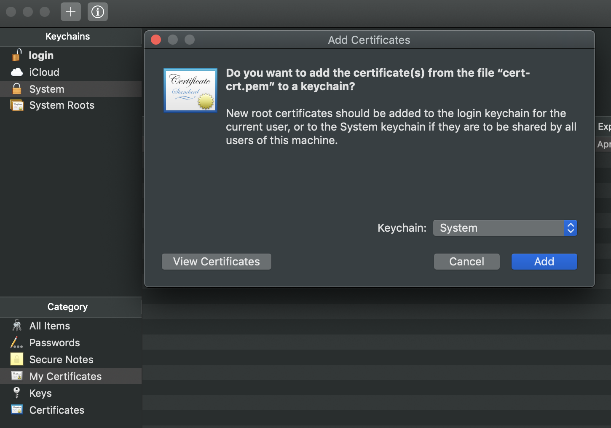
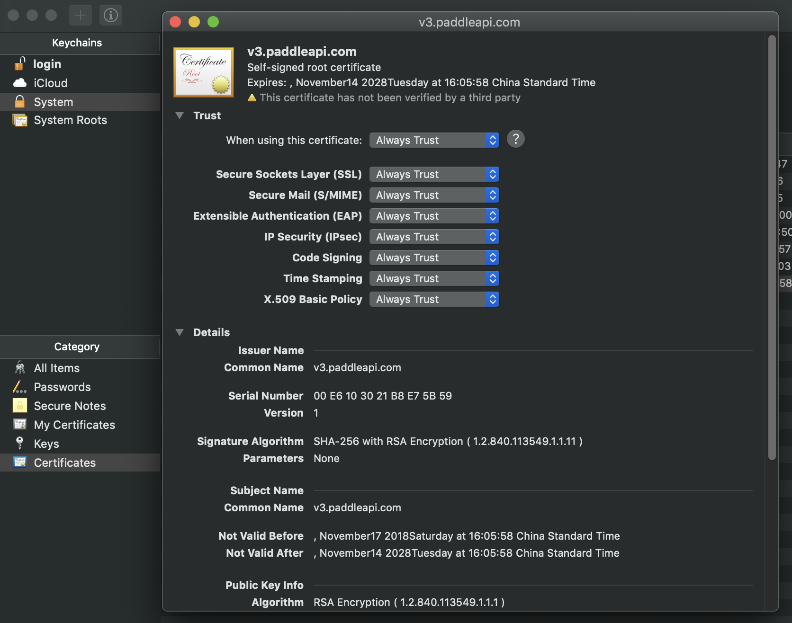
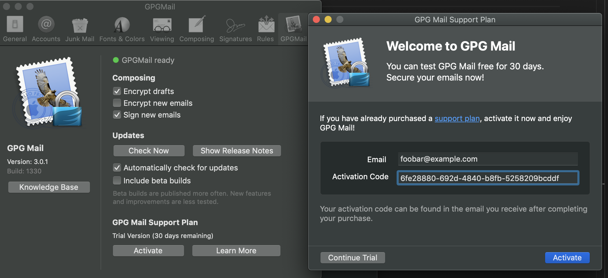
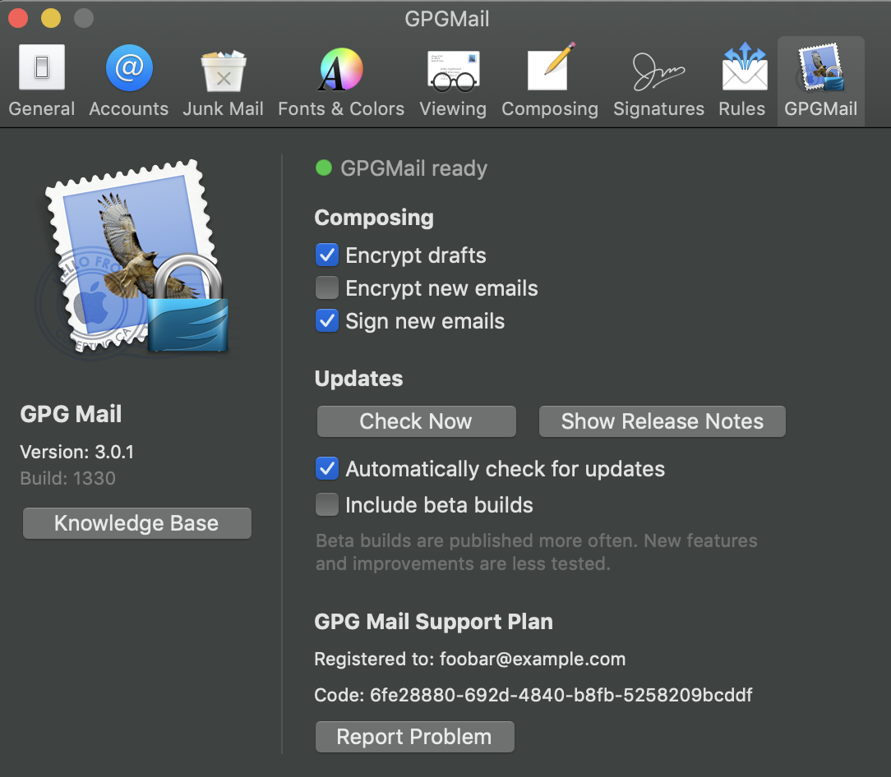

# GPGMail crack

## 1. GPGMail是什么

GPGMail是macOS上Mail应用的一个扩展，它提供了邮件的公钥加密和签名服务。GPGMail运行在macOS下，并且与加密相关的功能事实上是由GNU Privacy Guard提供的。

从GPG Suite 2018.4版本开始，GPGMail不再使用免费许可。

## 2. 这个破解是如何运作的

在你键入你的email和激活码之后，GPGMail会以POST请求的方式发送一些信息给 `https://v3.paddleapi.com`，这些信息不仅包括你刚刚键入的email和激活码，还有你电脑的系统类型和硬件ID；这个https地址很可能是激活服务器。

之后这个所谓的激活服务器会检查收到的信息，并返回成功或者错误。

所以这个keygen所做的事情就是就是返回一个成功的结果，不管收到了怎样的POST请求。

## 3. 如何使用

由于这个POST请求是在HTTPS下的，我们必须实施中间人攻击。

### 3.1 导入自签名SSL证书

我已经准备好了一个SSL证书 `cert-crt.pem` 以及这个证书相对应的私钥 `cert-key.pem`。它们是通过以下命令生成的：

```
$ openssl req -x509 -newkey rsa:4096 -keyout cert-key.pem -out cert-crt.pem -nodes -days 3650 -subj '/CN=v3.paddleapi.com'
 ```

* PS: 当然如果你不放心，你可以自己生成证书，但务必保证`CN`名为`v3.paddleapi.com`。

现在你必须导入SSL证书 `cert-crt.pem` 到你的系统keychain中，并且总是信任该证书：





### 3.2 将v3.paddleapi.com解析到127.0.0.1

在 `/etc/hosts` 文件中添加一项

```
127.0.0.1    v3.paddleapi.com
```

### 3.3 运行HTTPS服务器

```
$ sudo ./paddleapi_server.py
```

* 为什么要 `sudo` ? 

  建立一个HTTPS服务器将会在443端口上绑定一个socket，而这个443是小于1024的，位于常用端口范围内；在macOS系统中，这需要root权限。

### 3.4 前往GPGMail设置中激活



* __注意：__ 激活码可以是任何内容，但长度必须在31~53之间。

* __注意：__ 你可以用 `gen_activation_code.py` 来生成一个随机的激活码。

  ```
  $ ./gen_activation_code.py
  ```

最后应该是像下面这个样子：



### 3.4 关闭HTTPS服务器并移除SSL证书

按下 `Ctrl + C` 来关闭HTTPS服务器. 

__考虑到安全原因，建议你移除掉刚刚导入的SSL证书。__

### 3.5 恢复hosts (可选)

如果你愿意的话，你可以在 `/etc/hosts` 中移除之前添加的项

```
127.0.0.1    v3.paddleapi.com
```
